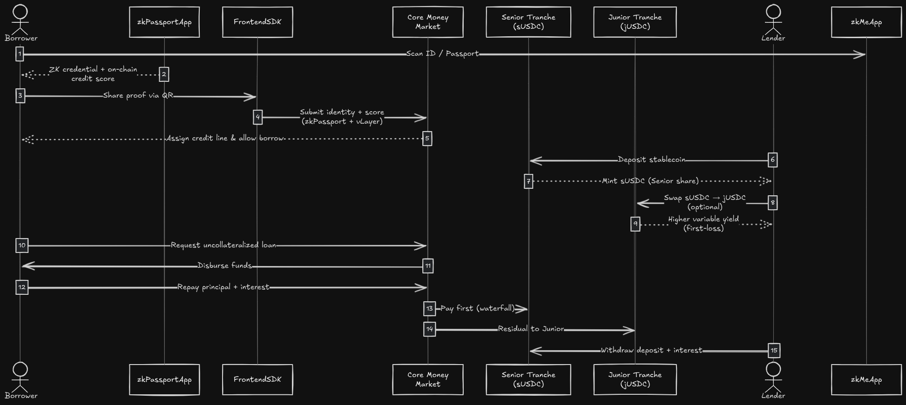

# 💳 Lendoor — Reputation‑Based Money Market

<p align="center">
  
</p>

<h1 align="center">Lendoor</h1>

<p align="center">
  <strong>Lendoor</strong> is a decentralized money market that enables <strong>uncollateralized lending</strong>, powered by zero‑knowledge identity and on‑chain reputation.  
This demo targets <strong>Polkadot Asset Hub (EVM testnet, “Paseo”)</strong>.
</p>


---

## Network

- **Network:** Polkadot Asset Hub — **Paseo (EVM testnet)**
- **Chain ID (dec):** `420420422`
- **Chain ID (hex):** `0x190f1b46`
- **RPC URL:** `https://testnet-passet-hub-eth-rpc.polkadot.io`
- **Block Explorer:** `https://blockscout-passet-hub.parity-testnet.parity.io`

<details>
<summary><strong>Wallet add (JSON)</strong></summary>

```json
{
  "chainId": "0x190f1b46",
  "chainName": "Polkadot Hub TestNet (Paseo)",
  "rpcUrls": ["https://testnet-passet-hub-eth-rpc.polkadot.io"],
  "nativeCurrency": { "name": "PAS", "symbol": "PAS", "decimals": 18 },
  "blockExplorerUrls": ["https://blockscout-passet-hub.parity-testnet.parity.io/"]
}
```
</details>

---

## Repository

```
/backend     → NestJS API (users, zk-passport, user journey, DB)
/contracts   → Solidity (Vault, Tranches, CreditLimitManager, RiskManager, Deploy scripts, Verifiers)
/frontend    → Vite + React + Tailwind (Borrow/Lend UI, proofs, /test page)
```

---

## Deployed Contracts (Testnet)

> Replace these with your latest deployments if you redeploy.

- **Lend Market:** `0x7913Be3D248E8Fc629F3F40a9e892A0D9ea04888`  
- **Senior ERC‑4626:** `0x8c0a45A1a3442F6Bc3aB553942139BB575036Ab1`  
- **Junior ERC‑4626:** `0x59987FD269ebf4Ec808410ad8b37E2bda879eC23`  
- **Risk Manager Shim:** `0xd062766dB617A1C48CE6D4017776A4554DcE62CB`  
- **Evault Adapter:** `0xd0602be1b9c3ED0715Be5786AD34114D9Da737BD`  
- **Credit Limit Manager:** `0x87B6F2A7A9e371f93bBbE75926400699202B8a58`  


---

## Contract ABIs (subset used by the app)

> Full ABIs live in the repository under `frontend/src/contracts/` (e.g., `CreditLimitManager.json`).  
> Below are the **minimal fragments** required for the demo UI and hooks.

---

## How it Works

Borrowers unlock credit without collateral by proving:

- **Identity/KYC** with **zkPassport** (privacy-preserving).
- **Financial reputation** with **vLayer**:
  - **Time‑Travel**: prove historical average balances.
  - **Teleporter**: prove cross‑chain liquidity without doxxing addresses.

Lenders provide liquidity in two tranches:

- **Senior (sUSDC)** — lower risk, priority in repayments, protected by junior buffer.  
- **Junior (jUSDC)** — higher yield, higher risk, absorbs first losses (can be negative in stress).


---

## System Flow Diagram

<p align="center">
  
</p>

---

## Quick Start

### 1) Clone

```bash
git clone https://github.com/lucholeonel/lendoor-polkadot
cd lendoor-polkadot
```

### 2) Backend

```bash
cd backend
cp .env.example .env 
# fill values from the sample below
yarn install
yarn dev
```

Visit `http://localhost:5003`.


### 3) Frontend

```bash
cd ../frontend
cp .env.example .env
# fill values from the sample below
yarn install
yarn dev
```

Visit `http://localhost:3003`.

### 4) Contracts (Foundry)

```bash
cd ../contracts-pas
forge install
forge build

# Example deploys (update RPC/PK)
forge script script/DeployAll.s.sol --rpc-url $RPC_URL --private-key $PRIVATE_KEY --broadcast
```

> Ensure `$RPC_URL` is the **Paseo** EVM RPC and the deploy key is funded test PK.  
> Update the addresses in your `.env` files after deploying.

---

## How to Test the Project

The frontend includes a minimal **`/test`** page that exercises read/write flows end‑to‑end.

1. **Connect Wallet** (Dynamic) and **switch to Paseo** if needed.
2. **Approve** USDC for the EVault (senior) and/or sUSDC for the Junior wrapper.
3. **Deposit**:
   - **USDC → sUSDC**: `EVault.deposit(assets, receiver)`
   - **sUSDC → jUSDC**: `JuniorERC4626.deposit(assets, receiver)` (via the junior wrapper)
4. **Borrow** within your **credit limit**: `EVault.borrow(assets, receiver)`
5. **Repay**: `EVault.repay(assets, receiver)`
6. **Withdraw**:
   - **sUSDC → USDC**: `EVault.withdraw(assets, receiver, owner)`
   - **jUSDC → sUSDC** (demote): `EVault.demoteToSenior(jShares, receiver)`  
     *(the UI computes `jShares` using `previewWithdrawJunior` and `convertToAssets`)*

The page also shows:

- Current **chain** and **account**,
- **Contract addresses** (linked to the explorer),
- Read‑only widgets for **credit line**, **sUSDC** and **jUSDC** balances,
- The **last transaction hash** and **log count**.

---

## 🤝 Credits

Built with ❤️ by the **Lendoor** team for the **Latin Hack**.
