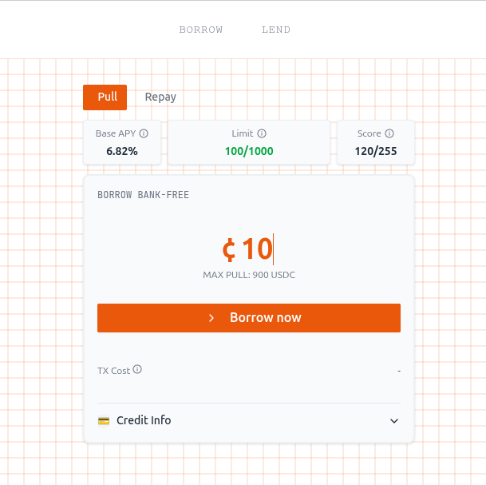

# 💳 Lendoor — The Reputation‑Based Money Market 

<p align="center">
  
</p>

<p align="center">
  <strong>Lendoor</strong> is a decentralized money market that enables <strong>uncollateralized lending</strong>, powered by zero‑knowledge proofs of identity and on‑chain reputation, deployed for the <strong>Polkadot Asset Hub (EVM testnet)</strong>.
</p>

---

## 🔍 What It Does

**Lendoor** unlocks **credit without collateral**.

Borrowers prove:
- **Identity/KYC** via **zkPassport**.
- **Financial reputation** via **vLayer**:
  - **Time‑Travel**: prove historical average balances or stable holdings.
  - **Teleporter**: prove liquidity across chains without exposing wallet addresses.  
    <em>(This edition targets Polkadot Asset Hub EVM testnet first; broader multi‑chain is planned.)</em>

Lenders allocate capital into **tranches**:
- **Senior (sUSDC)** — lower risk, priority in repayments, protected by junior buffer.  
- **Junior (jUSDC)** — higher yield, higher risk, absorbs first losses.  

---

## 🧪 How It Works

1. **Identity Verification (zkPassport)**  
   Users generate a zkPassport proof attesting to their verified identity and compliance with KYC, without revealing personal data.

2. **Reputation Proofs (vLayer)**  
   - **Time‑Travel proofs** show consistent on‑chain balance over the last 12 months.  
   - **Teleporter proofs** demonstrate cross‑chain liquidity (private address set).  

3. **Credit Line Allocation**  
   - The **CreditLimitManager** maps verified reputation signals into **borrow limits** and **risk‑adjusted rates**.  
   - Borrowers receive a credit line sized by their ZK‑backed score.

4. **Borrow / Lend Flow**  
   - Borrowers pull uncollateralized credit within their limit.  
   - Lenders choose tranches (Senior/Junior).

---

## 🔒 Why It Matters

- **Access to credit** without requiring collateral.  
- **Risk‑aligned incentives**: junior buffers senior, senior has payment priority.  
- **EVM‑compatible** on **Polkadot Asset Hub** with a path to multi‑chain.

---

## 📊 Key Financial Primitives (UI)

- **Base APY** — Baseline borrowing rate; final borrow APY = Base APY ± risk spread (depends on score, utilization, term).  
- **Borrow Limit** — `available = limit − outstanding principal − pending pulls`.  
- **Credit Score** — Reputation‑based (history, utilization, delinquencies, account age; verified backing can boost it).  
- **Average Balance (12m)** — Time‑weighted on‑chain balance.  
- **Cross‑chain Balance (current)** — Aggregated via vLayer Teleporter.  
- **sUSDC (Senior) APY** — ~80% of pool; ERC‑4626 share price driven.  
- **jUSDC (Junior) APY** — ~20% of pool; residual yield after senior; absorbs first losses.  
- **Backing TVV** — Total Verified Value backing credit lines.  
- **sUSDC/USDC, jUSDC/sUSDC** — Conversions from ERC‑4626 share price (subject to reserves, fees, cooldowns).

---

## 🧱 Protocol Architecture

**Smart Contracts (Solidity)**  
- `Vault.sol` — Core lending vault.  
- `CreditLimitManager.sol` — Computes borrower limits from ZK credentials.  
- `RiskManagerUncollat.sol` — Default & risk management for uncollateralized loans.  
- **Tranches**  
  - `JuniorERC4626.sol` — Junior tranche (ERC‑4626).  
- **Factories & Scripts**  
  - `DeployCLM.s.sol`, `03_EVault.s.sol`, `DeployJuniorERC4626.s.sol`, etc.  
- **Verifiers**  
  - vLayer verifier contracts (e.g., Average Balance).

**Backend (NestJS + SQLite)**  
- DID/identity orchestration, zkPassport integration, user journey flows, contract calls.

**Frontend (Vite + React + Tailwind)**  
- Borrow/Lend UI, KPIs (Base APY, Borrow Limits, Credit Score, TVV), proof flows.

---

## 🧰 Risk Tranches & Waterfall

- **Target composition**: **80% Senior** / **20% Junior** of TVL.  
- **Waterfall**: interest & principal repay **Senior first**, then **Junior**.  
- **Loss absorption**: **Junior** absorbs first losses.  
- **Variable Junior APY**: residual after Senior; can be higher than Senior in benign regimes and **negative** if losses exceed buffer.  
- **Cooldown**: possible delay when migrating Junior → Senior to avoid run dynamics.  
- **Redemptions**: subject to reserves, ERC‑4626 PPS, pending pulls, cooldowns.

### 📎 Numerical Mini‑Example (illustrative)

Borrow‑side weighted rate = 14.4%.  
Pool gross = 11.58%.  
After 10% protocol fee → ~10.42% net to LPs.  
If **Senior APY** is **10%**, then **Junior** ≈ **12.1%** residual.  
*(Figures are illustrative; real rates vary with utilization, spreads, fees, reserves, and realized P&L.)*

---

## 📁 Repository Structure

```
/backend        → NestJS API (users, zk-passport, user-journey, database)
/contracts      → Solidity contracts (Vault, Tranches, CreditLimitManager, RiskManager, Deploy scripts, Verifiers)
/frontend       → Vite + React + Tailwind (Borrow/Lend UI, proof flows, dashboards)
```

> Note: If you previously had `contracts-pas/`, it is now consolidated under `/contracts`.

---

## 🚀 Getting Started

### 1) Clone

```bash
git clone https://github.com/<your-org-or-user>/lendoor-polkadot
cd lendoor-polkadot
```

### 2) Backend

```bash
cd backend
cp .env.example .env  # if present; otherwise create a new .env
# paste the Backend .env block from below
yarn install
yarn dev
```

### 3) Frontend

```bash
cd ../frontend
cp .env.example .env  # if present; otherwise create a new .env
# paste the Frontend .env block from below
yarn install
yarn dev
```

### 4) Smart Contracts (Foundry)

```bash
cd ../contracts
forge install
forge build

# Example deploys (adjust to your needs)
# Credit Limit Manager
forge script script/DeployCLM.s.sol   --rpc-url $RPC_URL   --private-key $PRIVATE_KEY   --broadcast

# EVault
forge script script/03_EVault.s.sol   --rpc-url $RPC_URL   --private-key $PRIVATE_KEY   --broadcast

# Junior ERC4626
forge script script/DeployJuniorERC4626.s.sol   --rpc-url $RPC_URL   --private-key $PRIVATE_KEY   --broadcast
```

> Ensure your `$RPC_URL` points to **Polkadot Asset Hub (EVM testnet)** and `$PRIVATE_KEY` is a funded test key. Never commit secrets.

---

## ⚙️ Environment Setup

Create `.env` files for **frontend** and **backend** using the templates below.

> 🔐 **Security**: Do not commit real secrets (API tokens, private keys) to Git. Use a secrets manager for production.

### Frontend — `.env`

```dotenv
# URL your frontend will call for API requests
VITE_PUBLIC_BACKEND_URL="http://localhost:5000"   # If backend runs on 5001, set to http://localhost:5001

# Dynamic (wallet) environment
VITE_PUBLIC_DYNAMIC_ENV_ID="7c0129ea-c276-419f-a158-a5ba44df52a3"

# vLayer proving infra (public)
VITE_PUBLIC_VLAYER_API_TOKEN="<your_vlayer_jwt_token>"         # paste your JWT; keep secret
VITE_PUBLIC_VLAYER_PROVER_URL="https://stable-prod-prover.vlayer.xyz"

# vLayer verifier contract (Average Balance) — passet EVM testnet
VITE_VLAYER_AVERAGE_BALANCE_ADDRESS="0x2C244c18b9D4E24Ad3f21e6BA7bFE0fFa492aB05"

# Deployed contracts (update if you redeploy)
VITE_EVAULT="0x521555e6cf3a0062D22b6D08aAFc2F3a4761B8e2"
VITE_EVAULT_JUNIOR="0x9D075E2EA814ba0537607aD657a80fCd8f7ce131"

# NOTE: Replace with the correct USDC (or test USDC) on passet EVM testnet if different
VITE_USDC="0xA0b86991c6218b36c1d19D4a2e9Eb0cE3606eB48"

VITE_CREDIT_MANAGER_ADDRESS="0xf100c356aF3DC43DBB6bb3d62D4eE915E98cc8a9"
```

### Backend — `.env`

```dotenv
# Self URL (what the frontend points to)
VITE_PUBLIC_BACKEND_URL="http://localhost:5001"

# Dynamic (wallet) environment
VITE_PUBLIC_DYNAMIC_ENV_ID="7c0129ea-c276-419f-a158-a5ba44df52a3"

# vLayer proving infra (server-side usage optional)
VITE_PUBLIC_VLAYER_API_TOKEN=""                                   # optional server-side use
VITE_PUBLIC_VLAYER_PROVER_URL="https://stable-prod-prover.vlayer.xyz"

# vLayer verifier contract (Average Balance)
VITE_VLAYER_AVERAGE_BALANCE_ADDRESS="0x2C244c18b9D4E24Ad3f21e6BA7bFE0fFa492aB05"

# Protocol contracts
VITE_CREDIT_MANAGER_ADDRESS="0xf100c356aF3DC43DBB6bb3d62D4eE915E98cc8a9"

# Signer & network (Polkadot Asset Hub — EVM testnet)
PRIVATE_KEY="<your_private_key_hex>"                               # keep secret
BASE_URL="http://localhost:5001"
RPC_URL="https://testnet-passet-hub-eth-rpc.polkadot.io"
```

> If you use server code that reads `RPC_URL`, `PRIVATE_KEY`, and `VITE_EVAULT`, make sure those vars exist in your backend `.env` and match the deployed addresses.

---

## 🧩 Contract Addresses (Testnet • Example)

- **EVault**: `0x521555e6cf3a0062D22b6D08aAFc2F3a4761B8e2`  
- **Junior EVault (ERC‑4626)**: `0x9D075E2EA814ba0537607aD657a80fCd8f7ce131`  
- **CreditLimitManager**: `0xf100c356aF3DC43DBB6bb3d62D4eE915E98cc8a9`  
- **vLayer AverageBalance Verifier**: `0x2C244c18b9D4E24Ad3f21e6BA7bFE0fFa492aB05`  
- **USDC (test asset)**: `0xA0b86991c6218b36c1d19D4a2e9Eb0cE3606eB48` *(replace if different on passet)*

> These are placeholders from your current setup; update after redeploys.

---

## ▶️ Local Run Checklist

- Backend running on **http://localhost:5001** (or update `VITE_PUBLIC_BACKEND_URL` in frontend).  
- Frontend dev server running (`yarn dev`).  
- Wallet connected (Dynamic).  
- RPC set to **Polkadot Asset Hub EVM testnet**.  
- Test tokens funded for gas & USDC flow (faucet or mint, depending on your test setup).

---

## 🛡️ Security & Disclaimers

- This is hackathon software—unaudited, experimental. Do not use in production or with real funds.  
- Always keep private keys & API tokens out of version control.  
- Double‑check contract addresses and RPC endpoints before deploying or sending value.

---

## 🌍 Use Cases

- **Uncollateralized loans** for individuals in emerging markets.  
- **Fair lending** through reputation‑based pricing.  
- **Tranche markets** aligning incentives across risk profiles.  

---

## 🤝 Credits

Built with ❤️ by the **Lendoor** team for the **Latin Hack** (Polkadot).
